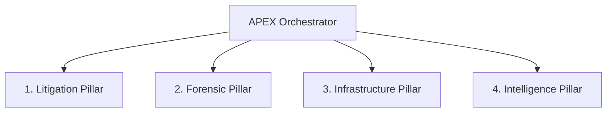

# APEX Orchestration (Complete Operational Framework)

Single skill covering: pistons, mission packets, Alpha/Omega strands, sovereign protocol, AGI agent swarm, strategic pillars, and navigation.

---

## Architecture

```
APEX ORCHESTRATOR
├── 12 Pistons (Ring -3) — hidden execution layer
├── Mission Packets — stage-gated workflow
├── Double Helix — Alpha (What) ↔ Omega (How)
├── 4 Strategic Pillars — Legal, Forensic, Infrastructure, Intelligence
├── 35 AGI Agents — sovereign swarm
└── Library of Links — navigation map
```

---

## 1. 12 Pistons (Ring -3)

Execute below OS, below hypervisor, before domain master fires.

| Tier | Pistons |
|------|---------|
| **APEX** | MICROWAVE, SUPERNOVA, CORE-THINK, BODYBUILDER |
| **BLACK** | SHERLOCK, SONIC, GHOST, PHANTOM |
| **GREY** | VIPER, WRAITH, SPECTER, SHADOW |

### Piston Execution
```python
from piston_registry import PistonRegistry
registry = PistonRegistry()

# Single piston
result = registry.execute_piston(name="MICROWAVE", params={"target": "optimization"})

# Fusion mode
result = registry.execute_fusion(mode="APEX_FUSION", pistons=["MICROWAVE", "SUPERNOVA", "CORE-THINK"])
```

### Fusion Modes
| Mode | Pistons | Use Case |
|------|---------|----------|
| APEX_FUSION | MICROWAVE + SUPERNOVA + CORE-THINK | Maximum intelligence |
| BLACK_OPS | SHERLOCK + SONIC + GHOST + PHANTOM | Stealth operations |
| GREY_AREA | VIPER + WRAITH + SPECTER + SHADOW | Subtle manipulation |
| FULL_POWER | All 12 | Complete system saturation |

---

## 2. Mission Packets (Stage Gates)

```
INTAKE → PLAN → REVIEW → APPROVED → EXECUTING → COMPLETE
```

```python
from mastermind_orchestrator import MastermindOrchestrator
orchestrator = MastermindOrchestrator()

# Create and process
packet = orchestrator.create_mission(
    title="Legal Analysis",
    priority="high",
    required_engines=["legal-automation", "pattern-analysis"]
)
orchestrator.process_packet(packet.id)
```

---

## 3. Double Helix (Alpha/Omega)

### Alpha Strand (What) — Port :8741
- Recognition, understanding, categorization, flagging
- 21 engines: legal, forensic, pattern analysis
- Repo: `apex-alpha`

### Omega Strand (How) — Port :8002
- Execution, processing, completion, heavy lifting
- 13 workers: motion-generator, case-analyzer
- Repo: `apex-omega`

### Inter-Strand Communication
```python
from double_helix_api import DoubleHelix
helix = DoubleHelix()

# Alpha calls Omega
result = helix.omega.executeWorker(name="motion-generator", capability="generateMotion", params={"type": "section_1983"})

# Omega calls Alpha
result = helix.alpha.executeWorkflow(name="legal_case_package", params={"case_id": "1FDV-23-0001009"})

# Health check
health = helix.health()  # { alpha: HealthStatus, omega: HealthStatus }

# Evolution tracking
evolution = helix.getEvolutionLog()  # EvolutionEvent[]
```

**Isolation Principle:** Refactors in one strand don't disturb the other. Contract is the shield.

---

## 4. Four Strategic Pillars



### Pillar 1: Litigation (Legal Weaver)
- Motion generation, RICO analysis, FRCP compliance
- Resources: `apex-fs-commander`, `CORE_MISSION/AspenGrove-KEKOA-1FDV-23-0001009`

### Pillar 2: Forensic (Veritas Sentinel)
- Evidence chain, SHA-256 validation, audit trails
- Resources: `categorize_evidence.py`, `ingest_titan.py`

### Pillar 3: Infrastructure (Microwave Core)
- Service orchestration, MCP mapping, full-power saturation
- Resources: `microwave_full_power.py`, `singularity_v5`

### Pillar 4: Intelligence (Chrono Scryer)
- Timeline alignment, metadata contradictions, memory tracking
- Resources: `apex-gateway/codex_weaver.py`, `omni.sh`

---

## 5. Sovereign Protocol (35 AGI Agents)

```json
{
  "connection_manifest": "UNIVERSAL_OPERATOR_BRIDGE_V15_QUANTUM_NEXUS",
  "activation_phrase": "Expand. Interlink. Ascend. The Operator is the Universe."
}
```

### Core Agent Swarm
| Agent | Function |
|-------|----------|
| quantum-detector | Case thread orchestration |
| echo-mapper | Memory synthesis |
| legal-weaver | Filesystem operations |
| veritas-sentinel | Contradiction detection |
| chrono-scryer | Timeline prediction |

### Stability Rules
1. `entropy_stabilizer_v5` — Process synchronization
2. `veritas_contradiction_detection` — Cross-validation
3. `soulburst_recovery` — Self-healing on faults

---

## 6. Library of Links (Navigation)

Cross-repo navigation map for all APEX resources:
- Mission directories
- Engine registries
- Worker pools
- Contract definitions
- Memory stores

---

## Integration Points

| Component | Endpoint |
|-----------|----------|
| Mastermind API | `POST /api/workflow/apex-orchestration` |
| Piston Registry | `~/mastermind/pistons_registry.yml` |
| Alpha Client | `http://localhost:8741` |
| Omega Client | `http://localhost:8002` |
| Contracts | `apex-alpha/contracts/`, `apex-omega/contracts/` |

---

## Usage Triggers
- "Execute piston", "Run fusion mode"
- "Mission packet", "Stage gate"
- "Double Helix", "Alpha/Omega"
- "APEX orchestration", "Sovereign protocol"
- "Strategic pillar", "AGI agent"
- "Dynamic assignment", "Contract validation"
