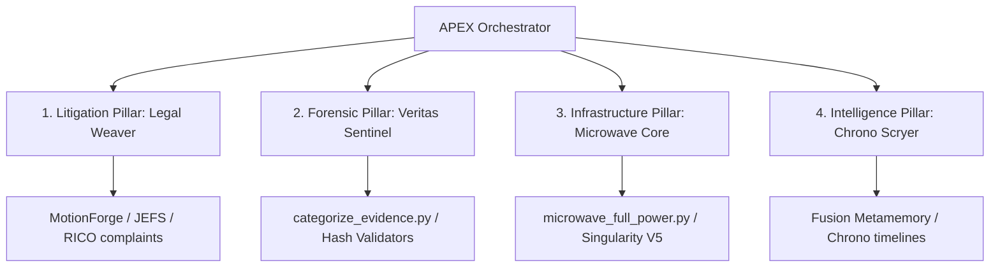

# APEX Tactical Pillars & Resource Maps

## Overview
This skill bridges the theoretical APEX frameworks with your machine's local scripts and environment engines. Use it to rapidly coordinate intelligence streams, litigation components, and full-power compute tasks.

## Core Reference
See `APEX_CORE.md` for foundational principles regarding Topological Surgicality, Surgical File Operations, State Management, and Verification Gates.

## Pillars

---

## ⚖️ 1. Litigation Pillar (MotionForge / Legal Weaver)
* **Focus**: State and Federal pleading automation, FRCP Rule 58 violations, GAL bias tracking.
* **Active Config**: `"legal_weaver": { "enabled": true, "templates": ["exhibit_a", "motion"] }`
* **Core Resources**:
    * [Legal Intel Node](file:///data/data/com.termux/files/home/apex-fs-commander)
    * [Case Memory Grove](file:///data/data/com.termux/files/home/CORE_MISSION/AspenGrove-KEKOA-1FDV-23-0001009)

## 🔍 2. Forensic Pillar (RealityValidator / Veritas Sentinel)
* **Focus**: Chronological audit trails, evidence sorting, SHA-256 validation.
* **Core Resources**:
    * [Evidence Classifier](file:///data/data/com.termux/files/home/categorize_evidence.py)
    * [Ingest Pipeline](file:///data/data/com.termux/files/home/ingest_titan.py)

## ⚡ 3. Infrastructure Pillar (Mastermind / Singularity Engine)
* **Focus**: Orchestration of services, local MCP mapping, full-power systems saturation.
* **Core Resources**:
    * [Full Power Orchestrator](file:///data/data/com.termux/files/home/microwave_full_power.py)
    * [Singularity Variant V5 Core](file:///data/data/com.termux/files/home/CORE_MISSION/APEX_SYSTEM_BLUEPRINTS/01_OMNI_ENGINE/omni_engine/Omni_Engine-main/omni-engine/mastermind-suite/repair-omnibus/microwave_v5_singularity.py)

## 🧠 4. Intelligence Pillar (Swarm-Mind / Chrono Scryer)
* **Focus**: Chronological timeline alignment, metadata contradictions, Fusion Metamemory tracking.
* **Core Resources**:
    * [APEX Gateway Sync](file:///data/data/com.termux/files/home/apex-gateway/codex_weaver.py)
    * [Omni Profile](file:///data/data/com.termux/files/home/APEX_BOOTUP/profiles/omni.sh)
