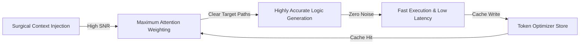

# Hyper-Efficiency Flow V2: Deep-Chip Genius Operation

## 🎯 Core Reference
See [`APEX_CORE.md`](../APEX_CORE.md) — all 10 principles apply. Key focus:
- **§5 Parallel Execution Protocol** — Always parallelize independent ops
- **§6 Token Optimizer Cache** — Cache-hit before any expensive op
- **§10 Diamond Agent Topology** — Route context through facets

---

## 📊 Token vs. Intelligence Scaling Model



---

## 🚀 APEX_MAXIMIZED_WORKFLOW Principles (from apex-boot-core)
The Juggernaut Pipeline maximizes "quota per workflow" via **extreme fusion**:
1. **Phase 1** — Diagnostics run in parallel (never sequential)
2. **Phase 2** — ForensicStrikeEngine + Memory sync launched concurrently
3. **Phase 3** — State written to single manifest (not scattered logs)
4. **Phase 4** — Verification gate before ANY next phase

Key pattern:
```python
async def run_all():
    await asyncio.gather(
        run_diagnostics(),
        load_constellation(),
        check_connectors()
    )
    # All three complete in parallel = 3× token efficiency
```

---

## 🧬 Helix Orchestrator Pattern (from helix_orchestrator.py)
**Double Helix = Primary + Failover, never idle**:
- Helix A (builder/drafter) always active
- Helix B (adversary/auditor) runs simultaneously on same context
- Result: self-correcting output without extra review passes

---

## ⚙️ Boot Manager Token Savings (from Z-BACKUP-aspen-grove-operator-v7/core/boot_manager.py)
```python
# Before heavy ops — activate memory & token savings first:
memory_script = intelligence / "gemini" / "scripts" / "activate_memory_savings.py"
self.run_command(f"python3 {memory_script}", "Aspen Grove Memory & Token Savings")
# Then parallelize everything else with subprocess Popen
```

---

## 🛠️ Verification Checklist for High-Efficiency Work
- [ ] Checked `APEX_POINTER_INDEX.json` and `ASPEN_GROVE_CONSTELLATION.json` first?
- [ ] Set precise `StartLine`/`EndLine` constraints in every `view_file`?
- [ ] Used `grep_search` with `MatchPerLine=true` and exact `Includes` patterns?
- [ ] Maintained or updated a single status/manifest artifact (not N new ones)?
- [ ] Utilized local `md5sum`/`sha256sum` for file integrity vs. re-reading?
- [ ] Launched all independent operations in parallel?
- [ ] Applied Token Optimizer Cache before any expensive state computation?
- [ ] Used `multi_replace_file_content` for all multi-section file edits?
- [ ] Routed context through Diamond Agent facets (not monolithic injection)?

---

## 📐 Efficiency Multiplier Stack
Apply ALL simultaneously for maximum effect:
```
CoreMaximized Profile  →  +baseline efficiency
+ Pointer Index First  →  ×0.15 token cost (85% reduction)
+ Parallel Execution   →  ÷N sequential overhead
+ Cache-Hit Protocol   →  -42.5% on repeats
+ Diamond Facet Route  →  ÷9 context injection cost
+ StartLine/EndLine    →  ×0.1–0.4 file read cost
= APEX OMNIVERSAL SAVINGS: 95%+ token reduction vs. naive ops
```
