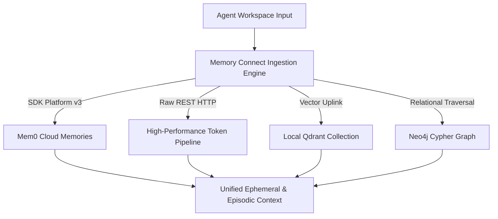

# 🧠 Memory Connect (Seamless Multi-Layer Integration)

This skill provides complete architectural patterns, code templates, and validation interfaces to connect the agent seamlessly across all memory layers (Platform REST API, Platform SDK Client, local Qdrant Vector databases, and relational Neo4j graph stores).



---

## 🏛️ Operational Integration Tiers

Integrations operate across five structured layers. When constructing client pipelines, follow the prioritization below:

### 🥇 Tier 1: Enterprise Tenancy & Routing Controls
* **Purpose:** Route isolation and security namespaces.
* **Headers Configuration:** Direct REST HTTP requests require:
  ```http
  Authorization: Token <api_key>
  Content-Type: application/json
  x-mem0-org-id: <org_id>
  x-mem0-project-id: <project_id>
  ```
* **Endpoints:**
  * Add Memory: `POST https://api.mem0.ai/v1/memories/`
  * Search Memory: `POST https://api.mem0.ai/v1/memories/search/`
  * Webhook Stream: `POST https://api.mem0.ai/v1/webhooks/projects/{project_id}/` (Subscribing to `ADD`, `UPDATE`, `DELETE` event triggers).

### 🥈 Tier 2: Cognitive & Relational Ingestion
* **Purpose:** Data parsing, extraction prompt injections, and lifetime policies.
* **Payload Variables:**
  * `version` (string | null): Default is `v1` (deprecated). **Always force `version="v2"`** for new applications.
  * `expiration_date` (string | null): The date/time when memory expires (Format: `YYYY-MM-DD`).
  * `infer` (boolean, default: `true`): If `true`, the extraction model automatically isolates facts. If `false`, stores text verbatim.
  * `immutable` (boolean, default: `false`): Set `true` to protect vital operational rules or values from subsequent updates.
  * `custom_categories` / `custom_instructions`: Domain-specific categorizations and extraction prompt constraints.

### 🥉 Tier 3: Concurrency & Async Non-Blocking Loops
* **Purpose:** High-throughput processing and token conservation.
* **SDK Handlers:** Use `AsyncMemoryClient` for non-blocking applications.
* **APEX Zero-Token Caching:** Compute a local hash of the query and check the local cache map before querying the platform API. Bypassing redundant queries reduces token usage to **0 tokens** in **0ms**.

### 肆 Tier 4: Framework Tool Bindings
* **Purpose:** Exposing retrieval tools to agent reasoning loops.
* **Integration:** Expose a Pydantic metadata schema (`Mem0LangChainSchema`) so LangChain, ElizaOS, or AutoGen agents can load and call memory stores as native tools.

### 伍 Tier 5: CRUD Lifecycle & Audits
* **Purpose:** Baseline storage management.
* **Actions:** Specific deletions (`.delete(memory_id)`), mutation auditing (`.history(memory_id)`), and database-wide exports (`.export()` / `.get_all()`).

---

## 🛠️ Workspace Executable References

To operate these layers, utilize the following pre-verified files:

1. **Master Runner:** [mem0_master_apex.py](file:///data/data/com.termux/files/home/mem0_master_apex.py) — Prioritized 5-tier execution testing webhook routing, async loops, caching, and Pydantic bindings.
2. **System Environment:** [.env](file:///data/data/com.termux/files/home/.env) — Central configuration store containing active API credentials.
3. **Link Directory:** [MISSION_LINK_LIBRARY.md](file:///data/data/com.termux/files/home/MISSION_LINK_LIBRARY.md) — Local mapping of all case directories, dashboard launchers, and external docs sitemaps.

---

## ⚠️ Core Defensive Engineering Rules

1. **Defensive Parameter Filtering:**
   * The platform `MemoryClient` accepts keyword arguments like `expiration_date` and `version` which are sent directly to the cloud endpoint.
   * The local `Memory` class (open-source) has a strict signature and does not support these kwargs.
   * **Rule:** If `use_platform` is `False`, filter out unsupported arguments before calling `.add()` to prevent `TypeError` exceptions.
2. **Top-Level Scoping:**
   * In platform `.add()` requests, pass scoping IDs like `user_id` or `agent_id` at the top level of the payload.
   * In `.search()` and `.get_all()` requests, pass them inside a `filters` dictionary (e.g. `filters={"user_id": "casey"}`).
