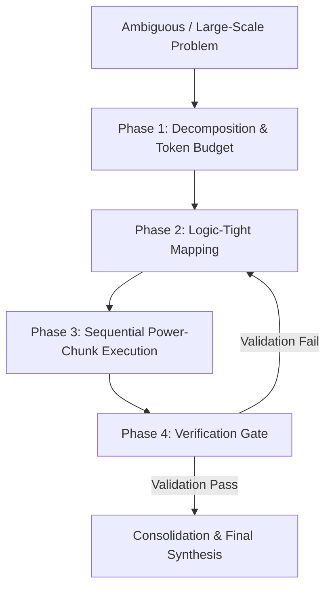

# Sequential Thinking & Chunked Power (APEX Edition)

## Overview
This skill provides a structured methodology for deconstructing complex, high-stakes tasks into manageable, logic-tight 'chunks'. It integrates the APEX Core Protocol to achieve maximum operational depth while reducing context volume.

## Core Reference
See `APEX_CORE.md` for foundational principles regarding Topological Surgicality, Surgical File Operations, State Management, and Verification Gates.

## The Dual-Protocol Engine

---

## 1. APEX Sequential Reasoning Framework

When encountering a high-complexity challenge, follow this mandatory sequence:

1. **Decomposition (Chunking)**: Break the objective into distinct, isolated phases or components.
2. **Logic Mapping & Topological Resolve**: Establish the exact boundaries of each chunk.
3. **Power-Chunk Execution**: Execute each chunk as an atomic, verified task.
4. **Verification Gate**: Validate the output of each chunk against the project's success criteria before proceeding to the next.
