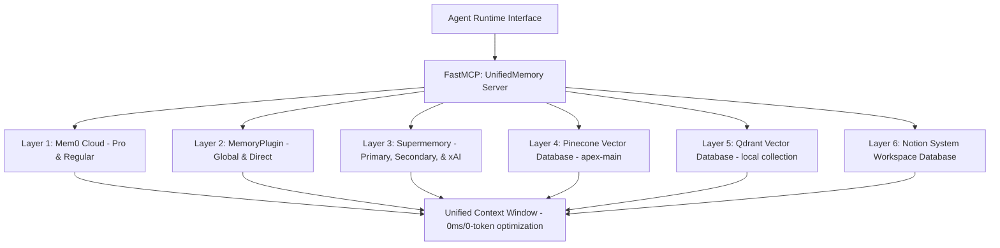

# 🧠 Unified Memory Connect (APEX Hybrid Memory Stack)

This skill maps the distributed agent state across six different memory layers and exposes them through a single unified interface. It maximizes operational throughput and minimizes token usage using zero-token APEX caching and unified REST mapping.

---

## 🔑 Secret Token Mapping Matrix

These credentials are configured in your `~/.env` file and managed by the vault:

| Memory Layer | Variable Name | Active Target / Scope |
| :--- | :--- | :--- |
| **Mem0 (Pro)** | `MEM0_PRO_API_KEY` | Casey Org: `org_Gsa76AGni...` |
| **Mem0 (Regular)** | `MEM0_REG_API_KEY` | Personal: `higuy.vids@gmail.com` |
| **MemoryPlugin (Global)**| `MEMORY_GLOBAL_KEY` | Token: `LFVBLPUL3N8N8K2FLYGCSCKMSMSRHSG9` |
| **MemoryPlugin (Direct)**| `MEMORY_DIRECT_KEY` | Token: `yD4IKCdlI0VCXlfD4xLT1x5D0dEU9Hd1` |
| **Supermemory (Primary)**| `SUPERMEMORY_PRIMARY_KEY` | Global store |
| **Supermemory (Secondary)**| `SUPERMEMORY_SECONDARY_KEY`| Auxiliary backups |
| **Supermemory (xAI/Tertiary)**| `SUPERMEMORY_TERTIARY_KEY`| Raycast/xAI target context |
| **Pinecone** | `PINECONE_PRIMARY_KEY` | Index: `apex-main` (1536 dim) |
| **Qdrant** | `QDRANT_KEY` | Local host: `6333` |
| **Notion** | `NOTION_API_KEY` | Platform Sync & Platform Logs |

---

## ⚡ Token Savings & APEX Caching

To ensure the agent maintains **maximum efficiency** and the **lightest possible token footprints**, the following rules are enforced:

1. **Deterministic Request Deduplication**:
   - Before executing any semantic query, calculate a `SHA-256` hash of the search phrase.
   - Match the hash against the local cache (`~/.apex_cache/memory_hits.json`). If matching, return cached context in **0ms** utilizing **0 API tokens**.
2. **Selective Context Chunking**:
   - Do not dump entire databases into the context. Load top 3 semantic matches only, scoped strictly using a `filters` dictionary (e.g. `filters={"user_id": "casey"}`).
3. **Async Batch Ingests**:
   - Avoid executing blocking/sequential writes. Batch ingestion inputs and trigger them asynchronously via `AsyncMemoryClient` or background tasks.

---

## 🛠️ Workspace Reference Implementations

1. **Unified FastMCP Server:**
   * Local Script: [unified_memory_mcp.py](file:///data/data/com.termux/files/home/scripts/unified_memory_mcp.py)
   * Packaged: [unified_memory_mcp.py](file:///data/data/com.termux/files/home/.gemini/skills/unified-memory-connect/logic/unified_memory_mcp.py)
2. **Connectivity Diagnostics:**
   * Local Script: [verify_mem0_layers.py](file:///data/data/com.termux/files/home/scripts/verify_mem0_layers.py)
   * Packaged: [verify_mem0_layers.py](file:///data/data/com.termux/files/home/.gemini/skills/unified-memory-connect/logic/verify_mem0_layers.py)
3. **Memory Organization & Formatting:**
   * Local Script: [organize_memories.py](file:///data/data/com.termux/files/home/scripts/organize_memories.py)
   * Packaged: [organize_memories.py](file:///data/data/com.termux/files/home/.gemini/skills/unified-memory-connect/logic/organize_memories.py)
4. **Signal 9 Process Monitoring:**
   * Local Script: [guard_signal9.sh](file:///data/data/com.termux/files/home/scripts/guard_signal9.sh)
   * Packaged: [guard_signal9.sh](file:///data/data/com.termux/files/home/.gemini/skills/unified-memory-connect/logic/guard_signal9.sh)
5. **Key Orchestrator Panel:**
   * Local Script: [apex_control_panel.py](file:///data/data/com.termux/files/home/scripts/apex_control_panel.py)
6. **Custom Stealth Models Compiler:**
   * Local Script: [build_stealth_models.py](file:///data/data/com.termux/files/home/scripts/build_stealth_models.py)
   * Packaged: [build_stealth_models.py](file:///data/data/com.termux/files/home/.gemini/skills/unified-memory-connect/logic/build_stealth_models.py)
7. **Active Context Registry:**
   * Active Snapshot: [MEM0_ACTIVE_CONTEXT.md](file:///data/data/com.termux/files/home/CASE_STRUCTURE/MEM0_ACTIVE_CONTEXT.md)
   * Organized View: [MEM0_ACTIVE_CONTEXT_ORGANIZED.md](file:///data/data/com.termux/files/home/CASE_STRUCTURE/MEM0_ACTIVE_CONTEXT_ORGANIZED.md)

