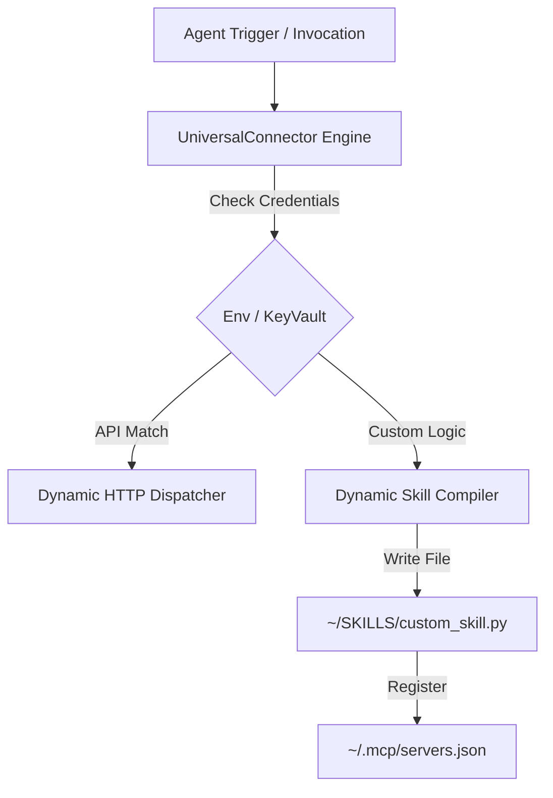

# 🌌 APEX Universal Connector Skill (Dynamic Integration)

## Overview
The `universal-connector` skill provides a dynamic, self-compiling bridge between the local agent environment and external SaaS APIs (GitHub, Supabase, Vercel, ClickUp, Sentry, Pinecone, Qdrant, etc.). It automates credential extraction, HTTP dispatching, dynamic python skill generation, and local MCP registry integration.

---

## 🛠️ System Architecture



---

## 🏗️ Core Execution Engine
The backend engine resides in:
*   [universal_connector.py](file:///data/data/com.termux/files/home/.gemini/skills/universal-connector/scripts/universal_connector.py)

To invoke the connector in any Python process:
```python
import sys
sys.path.append("/data/data/com.termux/files/home/.gemini/skills/universal-connector/scripts")
from universal_connector import UniversalConnector

# 1. Instantiate the connector
connector = UniversalConnector()

# 2. Trigger an authenticated request
repos = connector.execute_request(
    platform="github",
    endpoint="/user/repos",
    method="GET"
)
print(repos)
```

---

## 🧬 Dynamic Skill Generation Protocol
When the agent needs to compile a new local skill (e.g. `supermemory` or `motherduck` connections) on-the-fly:

1.  **Define Code Template:** Write a standalone Python script wrapping the target API using environment variables.
2.  **Invoke Compiler:** Call `generate_skill(name, code_template)` to write the file under `~/SKILLS/` and grant execute permission (`chmod 755`).
3.  **Register MCP:** Call `register_mcp_server(name, exec_path, args)` to register the new skill as a local MCP tool inside `~/.mcp/servers.json`.

---

## 🛡️ Security & Integrity Rules
- **No Hardcoded Keys:** Secrets must be retrieved dynamically from `OperatorKeyVault` or `.env`. Never commit raw tokens.
- **Strict File Permissions:** Dynamically generated scripts under `~/SKILLS/` must follow strict ownership rules (`chmod 700` or `755` only).
- **ISO/IEC 27037 Compliance:** All uploads/syncs to database registries (e.g. Supabase) must write audit trails to maintain a secure chain of custody.
